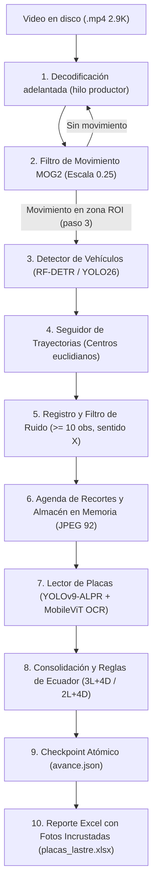

# Arquitectura del Algoritmo: Reconocimiento de Vehículos y Lectura de Placas

Este documento explica paso a paso cómo funciona el sistema completo desde que entra un archivo de video hasta que se genera el reporte en Excel con las fotos de evidencia incrustadas.

---



---

## 1. Entrada y decodificación de video

### ¿Qué hace?
Abre el video (2960×1664 a 25 fps) fotograma por fotograma. Para que el procesador no se quede esperando a que OpenCV descomprima el cuadro, se usa un **productor-consumidor en segundo plano** con una cola de tamaño 2 (`queue.Queue(maxsize=2)`). Mientras la CPU/GPU procesa el cuadro actual, el hilo secundario ya tiene el siguiente listo en memoria.

* **Archivos clave:**
  * [`lastre/video.py`](file:///Users/desarrollopashq/Documents/GitHub/PlacasVideos/lastre/video.py) (`iterar_cuadros`)
  * [`lastre/adelanto.py`](file:///Users/desarrollopashq/Documents/GitHub/PlacasVideos/lastre/adelanto.py) (`cuadros_adelantados`)

```python
# lastre/video.py
def iterar_cuadros(ruta):
    captura = cv2.VideoCapture(str(ruta))
    numero = 0
    while True:
        exito, cuadro = captura.read()
        if not exito:
            break
        numero += 1
        yield numero, cuadro
```

---

## 2. Filtro de Movimiento Híbrido (MOG2)

### ¿Por qué existe?
Correr una red neuronal en cada uno de los 8,200 fotogramas de un video de 5 minutos tomaría horas en CPU. La vía de lastre pasa la mayor parte del tiempo vacía. El filtro de movimiento descarta el 90% de los fotogramas vacíos en solo 1-2 ms.

### ¿Cómo funciona?
1. **Reducción de escala:** El cuadro 2.9K se reduce a **0.25** (740×416 píxeles) para que el sustractor de fondo no gaste CPU.
2. **Máscara de Zona:** Se aplica una máscara binaria basada en el polígono de [`config/zona.json`](file:///Users/desarrollopashq/Documents/GitHub/PlacasVideos/config/zona.json) para ignorar el movimiento de la carretera principal o las copas de los árboles.
3. **MOG2:** `cv2.createBackgroundSubtractorMOG2(history=500, varThreshold=16)`.
4. **Activación:** Si el área de píxeles en movimiento dentro del polígono supera `area_minima = 3000`, el fotograma se marca con movimiento.

* **Archivo clave:** [`lastre/deteccion.py`](file:///Users/desarrollopashq/Documents/GitHub/PlacasVideos/lastre/deteccion.py) y [`lastre/vehiculos.py`](file:///Users/desarrollopashq/Documents/GitHub/PlacasVideos/lastre/vehiculos.py) (`DetectorHibrido`)

```python
# lastre/vehiculos.py (DetectorHibrido)
def detectar(self, cuadro):
    hay_movimiento = self._movimiento.hay_movimiento(cuadro)
    # Solo evalúa la red neuronal cada 'paso' cuadros (paso=3) SI hubo movimiento
    if (self._cuadros_vistos % self._paso) == 0 and hay_movimiento:
        return self._detector.detectar(cuadro)
    return ()
```

---

## 3. Detección de Vehículos (Red Neuronal)

### ¿Qué hace?
Cuando el filtro detecta movimiento, se invoca al detector neuronal para reconocer el vehículo físico y descartar sombras o destellos de luz.

### Parámetros y lógica:
* **Modelos soportados:**
  * **RF-DETR Nano 384** (predeterminado de producción, alta precisión en motos y camiones).
  * **YOLO26n / YOLO26s** (candidato experimental de alta velocidad).
* **Clases filtradas:** Solo vehículos de catálogo COCO: `car`, `motorcycle`, `bus`, `truck`.
* **Filtro de Zona:** [`lastre/zona.py`](file:///Users/desarrollopashq/Documents/GitHub/PlacasVideos/lastre/zona.py) verifica mediante `cv2.pointPolygonTest` que el **centro del vehículo** esté dentro del polígono delimitado del carril de lastre. Si pasa un bus por la autopista de al lado, su centro queda fuera y se descarta.

```python
# lastre/zona.py
def punto_en_zona(punto, poligono):
    # Retorna >= 0 si el punto está dentro o en el borde del polígono
    return cv2.pointPolygonTest(poligono, punto, False) >= 0
```

---

## 4. Seguimiento Temporal de Trayectorias (Tracking)

### ¿Qué hace?
Asocia las detecciones de cuadros sucesivos para saber que el auto visto en el cuadro 730 es el mismo que avanza en el 733, 736, etc., formando una trayectoria única continua.

### ¿Cómo asocia?
* **Distancia euclidiana:** Calcula la distancia entre el centro de la nueva detección y el último centro conocido de las pistas activas. Si `distancia <= distancia_maxima (400 px)`, se asigna a esa pista.
* **Tolerancia a oclusiones:** Si un auto se oculta un instante o la red lo pierde un cuadro, la pista no muere de inmediato: espera hasta `tolerancia_oclusion = 25` cuadros antes de cerrarla.

* **Archivo clave:** [`lastre/seguimiento.py`](file:///Users/desarrollopashq/Documents/GitHub/PlacasVideos/lastre/seguimiento.py) (`SeguidorTrayectorias`)

---

## 5. Registro de Vehículos y Sentido de Circulación

### ¿Qué hace?
Toma las trayectorias cerradas y elimina el ruido antes de pasar a la costosa fase de OCR.

1. **Filtro de ruido:** Un vehículo real permanece en escena varios segundos; un reflejo o sombra solo dura 1 o 2 cuadros. Se descarta cualquier trayectoria con:
   $$\text{total\_observaciones} < \text{observaciones\_minimas (10)}$$
2. **Clasificación del sentido:**
   * Se compara la coordenada horizontal $X$ entre el inicio y el final de la pista:
     $$\Delta X = X_{\text{fin}} - X_{\text{inicio}}$$
   * Si $\Delta X \ge 150 \text{ px}$ $\rightarrow$ **"sale"** (hacia la vía principal).
   * Si $\Delta X \le -150 \text{ px}$ $\rightarrow$ **"entra"** (ingresando al predio).
   * Si el auto maniobra o gira, se usa el cruce con el segmento virtual de salida (`segmento_salida` en `zona.json`).

* **Archivo clave:** [`lastre/registro.py`](file:///Users/desarrollopashq/Documents/GitHub/PlacasVideos/lastre/registro.py) (`registrar_vehiculos`)

---

## 6. Agenda de Recortes y Almacén en Memoria

### ¿Por qué no guardar todo el video en RAM?
Un fotograma 2.9K sin comprimir pesa ~14.7 MB. Guardar cientos de fotogramas consumiría 10 GB de RAM y colapsaría Colab.

### La solución:
1. **Agenda:** [`lastre/agenda.py`](file:///Users/desarrollopashq/Documents/GitHub/PlacasVideos/lastre/agenda.py) marca qué observaciones son candidatas a OCR: aquellas con área suficiente para distinguir letras (`area >= 40000 px`). También reserva la observación más grande como `es_evidencia`.
2. **Almacén:** [`lastre/evidencia.py`](file:///Users/desarrollopashq/Documents/GitHub/PlacasVideos/lastre/evidencia.py) recorta únicamente el rectángulo del vehículo con un **margen de seguridad del 10%** (`margen=0.10`), lo comprime en memoria a JPEG calidad 92 (~60 KB) y libera el resto del fotograma.

```python
# lastre/placa.py
def recortar_vehiculo(cuadro, caja, margen=0.10):
    x, y, ancho, alto = caja
    dx = int(ancho * margen)
    dy = int(alto * margen)
    x1 = max(0, x - dx)
    y1 = max(0, y - dy)
    x2 = min(ancho_img, x + ancho + dx)
    y2 = min(alto_img, y + alto + dy)
    return cuadro[y1:y2, x1:x2].copy()
```

---

## 7. Detección de Placas y OCR (Fast-ALPR)

### ¿Qué hace?
Sobre el recorte del vehículo, ejecuta un pipeline de dos etapas neuronales especializadas:
1. **Detector de Placa:** Modelo YOLOv9-T ALPR (`yolo-v9-t-384-license-plate-end2end`), busca la pequeña caja rectangular de la matrícula dentro del auto.
2. **Reconocimiento de Caracteres (OCR):** Modelo MobileViT-v2 ALPR (`global-plates-mobile-vit-v2-model`), extrae el texto alfanumérico y la confianza individual de cada carácter.

* **Archivo clave:** [`lastre/placa.py`](file:///Users/desarrollopashq/Documents/GitHub/PlacasVideos/lastre/placa.py) (`LectorPlacas`)

---

## 8. Consolidación y Reglas de Matrícula de Ecuador

### ¿Qué hace?
Durante los 2 a 5 segundos que un auto cruza la cámara, el OCR puede leer la placa entre 5 y 30 veces con pequeñas variaciones por desenfoque o perspectiva (por ejemplo: `PCM2497` 18 veces, `PCM2491` 1 vez).

1. **Consenso por votación:** Se agrupan todas las lecturas y se calcula el porcentaje de coincidencia.
2. **Formato Ecuador:** [`lastre/formato_ecuador.py`](file:///Users/desarrollopashq/Documents/GitHub/PlacasVideos/lastre/formato_ecuador.py) aplica expresiones regulares y corrección de sustituciones típicas de OCR:
   * **Automóvil:** 3 letras + 3 o 4 dígitos (ej. `[A-Z]{3}[0-9]{3,4}`).
   * **Motocicleta:** 2 letras + 3 o 4 caracteres (ej. `[A-Z]{2}[0-9]{3,4}[A-Z]?`).
   * **Corrección:** Si en una posición obligatoria de letra aparece un número ('0' $\rightarrow$ 'O', '1' $\rightarrow$ 'I', '2' $\rightarrow$ 'Z', '5' $\rightarrow$ 'S', '8' $\rightarrow$ 'B'), se normaliza automáticamente.
3. **Estado final:**
   * `validado`: cumple formato oficial, leída al menos `minimo_lecturas (2)` veces y confianza $\ge 0.75$.
   * `pendiente de revision`: vehículo real detectado, pero placa dudosa, borrosa o sin consenso alto.

* **Archivo clave:** [`lastre/lectura.py`](file:///Users/desarrollopashq/Documents/GitHub/PlacasVideos/lastre/lectura.py) (`consolidar_lecturas`)

---

## 9. Sello Horario del Reloj de la Cámara

### ¿Qué hace?
El nombre del archivo de video indica cuándo arrancó el grabador NVR, pero no cuándo pasó el auto. La cámara imprime un reloj digital en la esquina (ej. `2026-09-09 16:17:46`).
* [`lastre/reloj.py`](file:///Users/desarrollopashq/Documents/GitHub/PlacasVideos/lastre/reloj.py) utiliza coincidencia de plantillas (`cv2.matchTemplate`) sobre la banda horaria de los primeros cuadros para anclar la hora real exacta del video y calcular el segundo preciso de paso de cada vehículo.

---

## 10. Salidas: Checkpoints y Excel con Imágenes

1. **Checkpoint Atómico ([`lastre/checkpoint.py`](file:///Users/desarrollopashq/Documents/GitHub/PlacasVideos/lastre/checkpoint.py)):**
   Cada vez que termina un video, se guarda de inmediato su resultado en `avance.json` usando un archivo temporal atómico (`avance.tmp` $\rightarrow$ `avance.json`). Si la sesión de Colab se desconecta, el trabajo no se pierde.
2. **Reporte Excel ([`lastre/excel.py`](file:///Users/desarrollopashq/Documents/GitHub/PlacasVideos/lastre/excel.py)):**
   Genera `placas_lastre.xlsx` formateado profesionalmente con:
   * Placa detectada
   * Fecha y hora exacta de paso
   * Sentido (sale / entra)
   * Tipo (automóvil / motocicleta)
   * Nivel de confianza y consenso
   * **Foto de evidencia incrustada** en la fila del Excel para que el usuario verifique la lectura a simple vista sin buscar en carpetas.

---

## ¿Dónde se pueden hacer mejoras a futuro?

1. **Descartar NMS multiclasa:** En modelos YOLO, suprimir cajas superpuestas (IoU > 0.98) para que un camión o bus no genere dos pistas paralelas (`bus` + `car`).
2. **Margen adaptativo según tamaño:** Los autos grandes requieren 10% de margen, pero las motos inclinadas se benefician de 15% o 20% para que la placa no quede al borde del recorte.
3. **Persistencia de modelos en memoria (Colab):** Mantener las sesiones ONNX abiertas entre video y video para evitar los 4 a 6 segundos de recarga por archivo.
